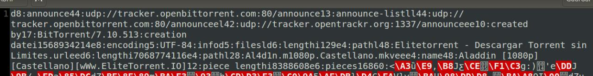

# Introducción

# Peer-to-peer

Una **red peer-to-peer** (P2P) es una red de ordenadores en la que todos o algunos aspectos funcionan sin clientes ni servidores, sino con una serie de nodos que son iguales entre sí, esto es, actúan simultáneamente como clientes y servidores entre ellos.

Las redes P2P permiten el intercambio directo de información entre dos ordenadores interconectados.

Además, las conexiones P2P aprovechan, administran y optimizan el uso del ancho de banda de los demás usuarios de la red por la conectividad de los mismos, obteniendo así más rendimiento en las conexiones y transferencias que con algunos métodos centralizados convencionales.

## Aplicaciones

La red P2P tiene las siguientes aplicaciones:

- Compartir, intercambiar y buscar archivos de cualquier tipo.
- Telefonía VoIP para hacer más eficiente la transmisión de datos en tiempo real, como Skype.
- Sistemas de ficheros distribuidos, como CFS o Freenet.
- Sistemas para garantizar anonimato, como i2p.
- Cálculos científicos que procesen enormes bases de datos.
- Monedas virtuales.
- Grabadores de sistemas de CCTV.

## Características

Las características de la red P2P son numerosas:

- **Escalabilidad**: lo deseable es que cuantos más nodos estén conectados a una red P2P, mejor será su funcionamiento. Así, cuando los nodos se conectan y comparten sus propios recursos, los recursos totales del sistema P2P aumentan, lo cual difiere del diseño tradicional de cliente-servidor.
- **Robustez**: Al ser distribuidas las redes P2P incrementan la robustez en caso de fallos  en la réplica de datos a varios destinos.
- **Descentralización**: son descentralizadas por definición y no existen nodos especiales o distintos de otros, por ello ningún nodo es indispensable para que la red funcione.
- **Distribución de costes entre los usuarios**: se comparten recursos a cambio de recursos.
- **Anonimato**: es deseable que quede anónimo el creador o autor del contenido, así como el editor, lector, servidor donde se encuentra y la petición para encontrarlo, siempre que los usuarios lo requieran.
- **Seguridad**: sería conveniente poder identificar y evitar los nodos maliciosos, contenido infectado, espionaje de comunicaciones entre nodos, protección de recursos en la red... Esta característica es la menos implementada y tiene aún varios mecanismos en desarrollo, como cifrado multiclave.

## Problemas
Tenemos dos problemas principales:

- **Cómo encontrar un nodo conectado**: se suele solucionar haciendo una conexión a un servidor, que mantiene una lista de las IPs conectadas.
- **Cómo conectar dos nodos sin dirección IP pública**: los nodos se conectan a través de otro nodo que funciona como proxy. Cualquier nodo con IP pública puede ser escogido como proxy.

## Clasificación
Existen varios criterios para clasificar las redes P2P, ya sea según el grado de centralización, su estructuración, generación a la que pertenezcan, grado de protección de nuestra identidad y enrutamiento y descubrimiento de recursos.

### Criterio de clasificación según grado de centralización:
- **Centralizadas**: se basa en una arquitectura monolítica en la que todas las transacciones se hacen a través de un único servidor que sirve de enlace entre dos nodos y almacena y distribuye los nodos donde se almacenan contenidos.
- **Mixtas**: hay interacción entre un servidor central que administra los recursos de banda ancha, enrutamiento y comunicación entre nodos, pero sin saber la identidad de cada nodo ni almacenar información.
- **Puras**: son las más comunes, no requiere usar un servidor central, por lo que se opta por los mismos usuarios como nodos de esas conexiones y almacenadores de  la información. Todas las comunicaciones son directamente de usuario a usuario con ayuda de otro nodo (otro usuario).

### Criterio de clasificación según grado de anonimato
- **Sin características de anonimato**.
- **Pseudónimo**.
- **Red P2P Privada**: solo IPs de confianza pueden conectarse.
- **Frient-to-friend**: solo te conectas con "amigos", solo admite direcciones IP donde confías.

# BitTorrent

El **BitTorrent** es un protocolo diseñado para el intercambio de archivos peer-to-peer en Internet. Lo más destacable es que se puede hacer transferencias de archivos grandes.

Este protocolo fue diseñado por Bram Cohen en 2001 y existen clientes BitTorrent en varios sistemas operativos. Con respecto a los usuarios, hay que destacar que más de 170 millones de personas usan su producto cada mes. Además, este protocolo mueve hasta el 40% del tráfico mundial de Internet diariamente. BitTorrent también ha lanzado su propia **criptomoneda** para mejorar la velocidad de la red y así descargar torrents más rápidos.

El BitTorrent consiste en que los usuarios se unan entre ellos en un "enjambre" para descargar y subir el archivo de forma simultánea. Para subir un archivo, primero hay que crear un archivo **torrent** y distribuirlo. Después el archivo está disponible en la red a través de un nodo BitTorrent que actúa como semilla. Si queremos descargarlo, obtendremos el archivo torrent y creamos otro nodo BitTorrent que actúa como cliente, intercambiando partes del archivo con la semilla y con otros clientes. Si un archivo se está distribuyendo, se divide en pequeñas partes y cada usuario recibe una parte nueva del archivo, que puede compartirla con otros usuarios. Luego la semilla original se libera de tener que enviar una copia de esta parte a todos los usuarios.

Cuando un usuario descarga un archivo, no se descargan las partes de dicho archivo secuencialmente, sino que BitTorrent las reordena y comprueba que partes se han descargado y cuáles no. Cada parte del archivo tiene el mismo tamaño y se transmiten de una sola vez, por lo que podemos detener la descarga y reanudarla en otro momento sin perder información. Esta característica hace que BitTorrent sea muy útil para la transferencia de archivos grandes. Cuando ya se ha descargado el archivo, el cliente se convierte en una semilla.

Con respecto a **seguridad**, cada parte del archivo está protegida por un hash criptográfico, por lo que si se produce alguna modificación (bien o mal intencionada) se puede detectar. Es posible gracias al nodo que tiene el archivo torrent auténtico, luego se puede comparar con este para verificar que no ha habido alguna modificación.

Gracias al diseño de este protocolo, el distribuidor original puede reducir los costes de hardware y de ancho de banda. También proporciona redundancia ante posibles problemas del sistema, reduce las dependencias con el distribuidor original y proporciona fuentes de descarga transitorias.

# Programas clientes

Estos programas sirven para abrir el archivo `.torrent` y así descargar la información que contiene. Hay dos tipos distintos de clientes:

- **Múltiples descargas simultáneas**: Vuze, BitComet, KTorrent, $\mu$Torrent, Transmission...
- **Descarga única**: se descarga un solo archivo .torrent, pero puede haber varios abiertos simultáneamente. Por ejemplo: BitTornado, navegador Opera...

# Estructura de una red BitTorrent

Una red en BitTorrent está formada por:

- **Peers**: son los usuarios que están en la red.
- **Leechers**: son los usuarios que están en la red descargando un archivo pero aun no tienen el archivo completo. También pueden ser los usuarios que descargan los archivos pero no los comparten.
- **Seeders**: son los usuarios de la red que tienen el archivo completo.
- **Trackers**: es un servidor especial que contiene la información para que los Peers se conecten entre sí. Es útil para localizar a los usuarios que tienen el archivo que se quiere descargar.
- **Swarm**: son los usuarios que el tracker busca.

# Mecánica del funcionamiento de BitTorrent

En este apartado veremos cómo un usuario se descarga un archivo usando BitTorrent.

Primero, un usuario se descarga un archivo `.torrent` que contiene la información del fichero que queremos descargar. Dicho archivo contiene la dirección del tracker al que nos tenemos que conectar para unirnos al swarm de peers.

Lo siguiente es abrir el archivo `.torrent` con uno de los **programas cliente** que vimos anteriormente y así interpreta la información.

Después, el tracker y el Peer se comunican mediante una conexión HTTP. El tracker informa de la lista de todos los peers y seeders que contienen partes del archivo que queremos descargar. El tracker se actualiza con la información del nuevo Peer que acaba de ingresar.

Por último, cuando el Peer sabe dónde tiene que buscar las partes necesarias, se comunica con otros mediante sockets TCP o UDP y el archivo comienza a descargarse. Cada parte descargada se comparte con otros peers.

# Archivos Torrent
Los **archivos torrent** almacenan metadatos sobre archivos y carpetas que se van a distribuir y ser usados por un cliente de BitTorrent.

Un **torrent** es información acerca de un archivo de destino, aunque no contiene información acerca del contenido del mismo. Funcionan dividiendo el archivo de destino en pequeños fragmentos de información localizados en hosts diferentes. Así, los torrents son capaces de descargar archivos grandes rápidamente.

Cuando un cliente inicia una descarga por torrent, los fragmentos del archivo de destino necesarios pueden ser encontrados sin dificultad y, luego, el cliente puede unirlos, de forma que sean usables.

Un archivo torrent contiene las URL de distintos trackers y la integridad de los metadatos de todos los fragmentos, además de metadatos adicionales.

# Trackers
Un **tracker** de BitTorrent es un servidor especial que contiene la información necesaria para que los peers se conecten con otros peers asistiendo la comunicación entre ellos usando el protocolo bitTorrent. Los trackers son el único punto de encuentro al cual los clientes necesitan conectarse para comunicarse o comenzar una descarga.

Los trackers coordinan la comunicación y distribución de datos, mantienen las estadísticas y la información de verificación para cada torrent.

El tracker es el único que sabe dónde se encuentra cada peer dentro de un swarm, por lo que es indispensable para poder comunicarse con el resto de usuarios, al menos hasta haberse conectado al swarm.

## Clases
Los trackers se dividen en dos clases:

- **Privados**: requieren que los peers sean usuarios registrados en un sitio web.
- **Públicos**: cualquiera puede comunicarse con ellos.

# Ventajas

El BitTorrent tiene numerosas ventajas, entre ellas destacan:

- **No se saturan los servidores**: se ahorra ancho de banda ya que no tienen que enviar un archivo a todos los clientes. También se aprovecha el ancho de banda de los usuarios que están descargando el archivo.
- **Redundancia**: se puede acceder a un archivo aunque el servidor no esté disponible siempre que al menos un peer haya recibido el archivo completo.
- **Alta disponibilidad a la hora de descargar**: al haber tantos usuarios, podemos descargar sus archivos simultáneamente.

# Problemas

Sin embargo, este protocolo también tiene sus inconvenientes:

- **Errores o trampas**: se pueden producir errores al componer el archivo completo o incluso algunos archivos pueden ser falsos y no tener el contenido que dicen tener.
- **Dependencia de los peers**: esto ocurre si un usuario al descargar un archivo se desconecta o la velocidad de los usuarios que comparten los archivos está limitada.
- **Dependencia del tracker**: sin el tracker las transferencias no se podrían hacer.

# Referencias
- [https://es.wikipedia.org/wiki/Peer-to-peer](https://es.wikipedia.org/wiki/Peer-to-peer)
- [https://en.wikipedia.org/wiki/Peer-to-peer](https://en.wikipedia.org/wiki/Peer-to-peer)
- [https://es.wikipedia.org/wiki/Archivo_Torrent](https://es.wikipedia.org/wiki/Archivo_Torrent)
- [https://es.wikipedia.org/wiki/Tracker_(BitTorrent)](https://es.wikipedia.org/wiki/Tracker_(BitTorrent))
- [https://es.wikipedia.org/wiki/BitTorrent](https://es.wikipedia.org/wiki/BitTorrent)
- [https://www.xatakamovil.com/conectividad/que-es-y-como-funciona-el-protocolo-bittorrent](https://www.xatakamovil.com/conectividad/que-es-y-como-funciona-el-protocolo-bittorrent)
