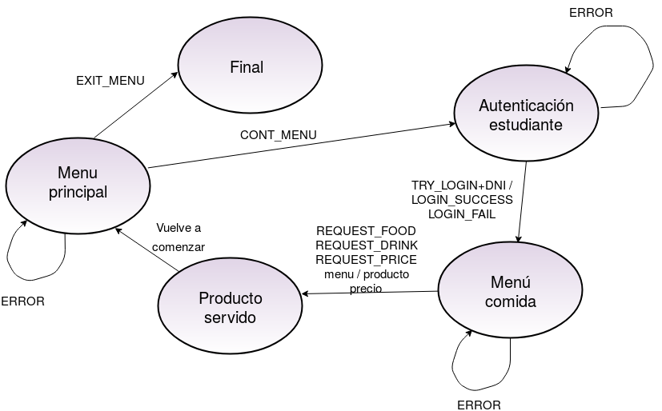
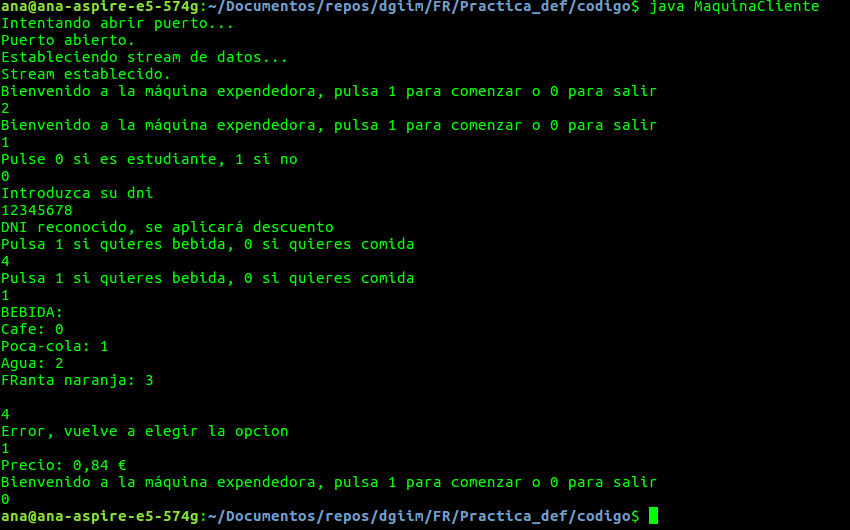

# Práctica 2: Máquina expendedora (cliente - servidor)

## Descripción de la aplicación, funcionalidad y actores que intervienen

Para realizar el ejercicio 5, hemos propuesto una máquina expendedora donde el usuario puede elegir qué comida o bebida quiere comprar. Además, al principio puede identificarse mediante su DNI para aplicar el descuento de estudiante. Al servir el pedido se vuelve al menú inicial, desde el cuál se puede pedir otro producto o salir de la máquina.

Al principio, hay que pulsar la tecla `1` para comenzar el pedido o `0` para salir, si se pulsa cualquier otra tecla vuelve a aparecer dicho mensaje.

A continuación, hay que pulsar la tecla `0` si eres estudiante y si no, se pulsa `1`. En el caso de que seamos estudiantes, se nos pedirá el DNI para comprobar que somos estudiantes. Si introducimos un DNI falso, se detectará y no se aplicará el descuento. Los DNIs válidos los hemos guardado en el fichero `log_estudiante.txt`.

Lo siguiente será elegir entre comida o bebida:

- **Comida**: disponemos del siguiente menú con sus respectivas teclas que hay que pulsar:
    - FRuta: `0`
    - Kit kot: `1`
    - Galletas Newton: `2`
    - Sandwich: `3`

    Sin embargo, si pulsamos una tecla que no aparece en el menú, se detectará y no avanzará el programa hasta que pulsemos una tecla correcta.
- **Bebida**: disponemos del siguiente menú con sus respectivas teclas que hay que pulsar:
    - Cafe: `0`
    - Poca-cola: `1`
    - Agua: `2`
    - FRanta naranja: `3`

    Sin embargo, si pulsamos una tecla que no aparece en el menú, se detectará y no avanzará el programa hasta que pulsemos una tecla correcta.

Por último, nos dará nuestro pedido y el importe que hay que pagar.


## Diagrama de estados del servidor

Los estados por los que pasa el servidor de acuerdo a los eventos que puedan surgir o los mensajes que recibe por parte de los clientes se muestra en la siguiente imagen.



## Mensajes que intervienen

| **Código** | **Cuerpo** | **Descripción** |
| :---------: | :--------: | :-------------: |
| `TRY_LOGIN` | DNI | Indica al servidor que quiere realizar login usando el DNI |
| `LOGIN_SUCCESS` | - | Éxito al realizar el login |
| `LOGIN_FAIL` | - | Fallo al realizar el login |
| `EXIT_MENU` | - | Salir de la máquina |
| `CONT_MENU` | - | Comenzar a usar la máquina |
| `REQUEST_FOOD` | - | Le pide al servidor el menú de comida |
| `REQUEST_DRINK` | - | Le pide al servidor el menú de bebida |
| `REQUEST_PRICE` | - | Le pide al servidor el precio del menú |


## Capturas de pantalla de la aplicación

Primero, compilamos con `make`, luego ejecutamos `java MaquinaServidorIterativo` y por último ejecutamos en otra terminal `java MaquinaCliente`.

En la segunda terminal, nos aparecen los siguientes mensajes:

```
Intentando abrir puerto...
Puerto abierto.
Estableciendo stream de datos...
Stream establecido.
Bienvenido a la máquina expendedora, pulsa 1 para comenzar o 0 para salir
a
Bienvenido a la máquina expendedora, pulsa 1 para comenzar o 0 para salir
1
Pulse 0 si es estudiante, 1 si no
0
Introduzca su dni
12345678
DNI reconocido, se aplicará descuento
Pulsa 1 si quieres bebida, 0 si quieres comida
1
BEBIDA:
Cafe: 0
Poca-cola: 1
Agua: 2
FRanta naranja: 3

4
1
Precio: 0,84
Bienvenido a la máquina expendedora, pulsa 1 para comenzar o 0 para salir
0
```

