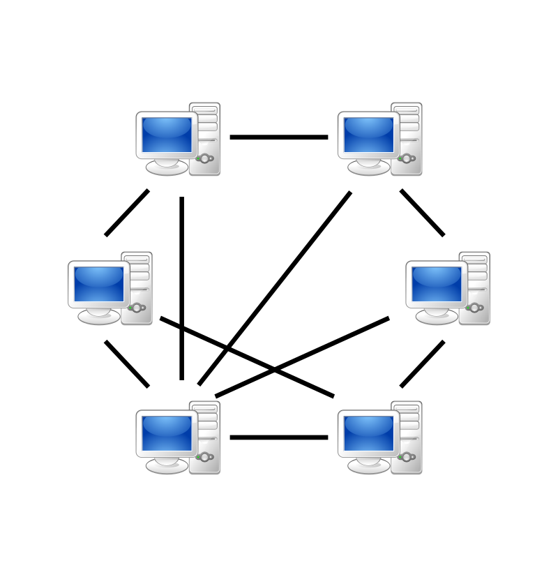
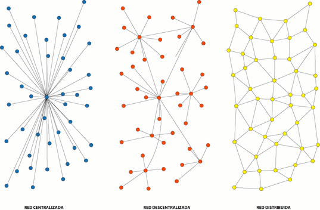
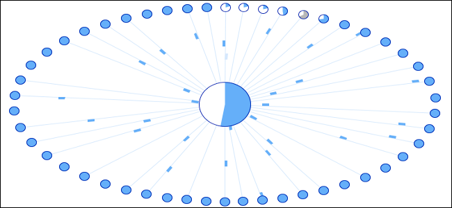
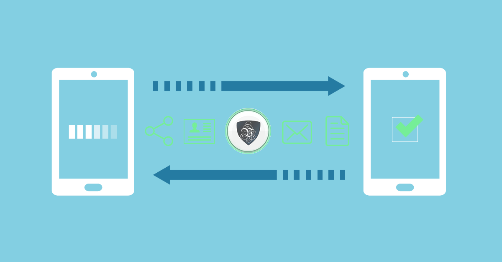
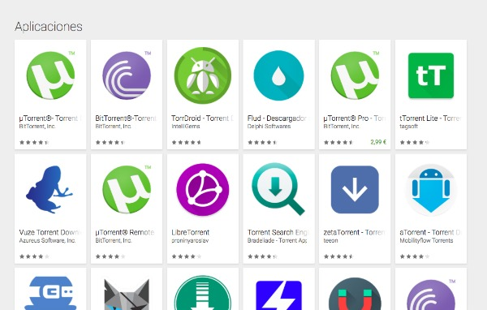
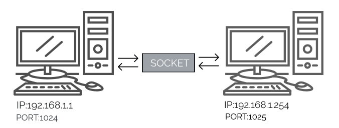
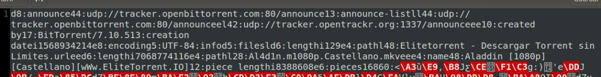
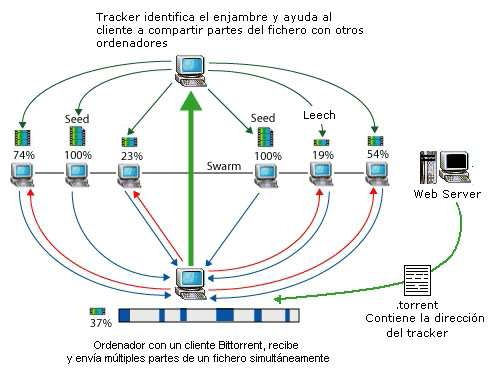

<section style="text-align: center;">

# BitTorrent

<section style="text-align: left;">

Ana Buendía Ruiz-Azuaga

Paula Villanueva Núñez

 DGIIM

---

## Índice

- Redes Peer-to-peer.
- BitTorrent
- Archivos Torrent
- Trackers

---

---

## Peer-to-peer

- Una red **P2P** es una red de ordenadores en la que todos o algunos aspectos funcionan sin clientes ni servidores, sino con nodos que son iguales entre sí.
- Actúan simultáneamente como clientes y servidores entre ellos.

---

## Peer-to-peer

- Aprovechan, administran y optimizan el uso del ancho de banda de los usuarios de la red por la conectividad de los mismos, obteniendo así más rendimiento.

---

### Aplicaciones

- Compartir, intercambiar y buscar archivos de cualquier tipo.
- Telefonía VoIP para hacer más eficiente la transmisión de datos en tiempo real, como Skype.
- Sistemas de ficheros distribuidos, como CFS o Freenet.

---

### Aplicaciones

- Sistemas para garantizar anonimato, como i2p.
- Cálculos científicos que procesen enormes bases de datos.
- Monedas virtuales.
- Grabadores de sistemas de CCTV.

---

### Características

- Escalabilidad.
- Robustez.
- Descentralización.
- Distribución de costes entre los usuarios.
- Anonimato.
- Seguridad.

---

### Problemas

- **Cómo encontrar un nodo conectado**: se suele solucionar haciendo una conexión a un servidor, que mantiene una lista de las IPs conectadas.
- **Cómo conectar dos nodos sin dirección IP pública**: los nodos se conectan a través de otro nodo que funciona como proxy. Cualquier nodo con IP pública puede ser escogido como proxy.
---

### Clasificación

Se pueden clasificar según:

- **Grado de centralización**.
- **Grado de anonimato**.

---

#### Criterio de clasificación según grado de centralización

- **Centralizadas**.
- **Mixtas**.
- **Puras**.

---

#### Criterio de clasificación según grado de centralización

---

#### Criterio de clasificación según grado de anonimato

- Sin características de anonimato.
- Pseudónimo.
- Red P2P Privada: solo IPs de confianza pueden conectarse.
- Frient-to-friend: solo IPs conocidas.

---

## BitTorrent

- Es un protocolo diseñado para el **intercambio de archivos P2P**.
- Transferencias de **archivos grandes**.
- Diseñado por Bram Cohen en 2001.
- Usado por **170 millones de personas** cada mes.
- Mueve hasta el **40% del tráfico** mundial de Internet.
- Propia **criptomoneda**.

---

## BitTorrent

- Los usuarios se unen en un *enjambre* para descargar y subir archivos simultáneamente.
- Para subir un archivo hay que subir su **`torrent`**.
- Se crea un nodo BitTorrent (**semilla**).
- Para descargarlo creamos otro nodo (**cliente**).

---

## BitTorrent

- Un archivo se distribuye en **pequeñas partes**.
- La **semilla original** no tiene que enviar las partes a todos los usuarios.
- Las partes no se descargan secuencialmente. BitTorrent las **reordena** y comprueba cuáles se han descargado.

---

## BitTorrent

- Cada parte tiene el **mismo tamaño**.
- Cada parte se **transmite** de una sola vez.
- Podemos detener la descarga y reanudarla **sin perder información**.
- Cuando se descarga el archivo, el cliente se convierte en **semilla**.

---

## BitTorrent

- Cada parte del archivo está protegida por un **hash criptográfico**.
- Se pueden detectar las **modificaciones** gracias a la semilla original.

---

## BitTorrent

- Reducir costes de hardware y de ancho de banda.
- Redundancia ante problemas del sistema.
- Reduce dependencias con el distribuidor original.
- Fuentes de descarga transitorias.

---

## Programas clientes

<section style="text-align: left;">

Sirven para abrir el archivo `.torrent` y descargar su información. Hay dos tipos:

- **Múltiples descargas simultáneas**: Vuze, BitComet, KTorrent, $\mu$Torrent, Transmission...
- **Descarga única**: puede haber varios `.torrent` abiertos simultáneamente, pero solo se descarga uno. Ejemplos: BitTornado, navegador Opera...

---

## Programas clientes

---

## Estructura de una BitTorrent

- **Peers**: usuarios.
- **Leechers**: usuarios que están descargando un archivo o los usuarios que descargan archivos pero no los comparten.
- **Seeders**: usuarios que tienen el archivo completo.
- **Trackers**: servidor especial con información para que los peers se conecten entre sí.
- **Swarm**: usuarios que el tracker busca.

---

## Mecánica del funcionamiento de BitTorrent

1. Descargar un archivo `.torrent`.
2. Abrir el archivo `.torrent` con un **programa cliente**.
3. El **tracker** y el **peer** se comunican mediante una conexión **HTTP**. El tracker informa de los peers y seeders que tienen nuestro archivo, y se actualiza con la información del nuevo peer que ingresa.

---

<section style="text-align: left;">

4.Cuando el **peer** sabe dónde tiene que buscar las partes, se comunica con otros mediante **sockets TCP o UDP**. El archivo comienza a **descargarse**. Cada parte descargada se comparte con otros peers.

<section style="text-align: center;">

---

## Archivos Torrent

- Los **archivos torrent** almacenan metadatos sobre archivos y carpetas que se van a distribuir y ser usados por un cliente de BitTorrent.
- Un **torrent** es información acerca de un archivo de destino. Funcionan dividiendo el archivo de destino en pequeños fragmentos de información localizados en hosts diferentes.

---

---

## Trackers

- Un **tracker** de BitTorrent es un servidor especial que contiene la información necesaria para que los peers se conecten con otros peers asistiendo la comunicación entre ellos usando el protocolo bitTorrent.
- Son el único punto de encuentro al cual los clientes necesitan conectarse.

---

<section style="text-align: center;">

### Clases

<section style="text-align: left;">

Los trackers se dividen en dos clases:

- **Privados**: requieren que los peers sean usuarios registrados en un sitio web.
- **Públicos**: cualquiera puede comunicarse con ellos.

---

---

## Ventajas

- **No se saturan los servidores**: se ahorra ancho de banda.
- **Redundancia**: se puede acceder a un archivo aunque el servidor no esté disponible siempre que algún peer haya recibido el archivo completo.
- **Alta disponibilidad a la hora de descargar**: descargar archivos simultáneamente.

---

## Problemas

- **Errores**: al componer el archivo.
- **Trampas**: puede haber archivos falsos.
- **Dependencia de los peers**: si un usuario al descargar un archivo se desconecta o la velocidad está limitada.
- **Dependencia del tracker**: sin el tracker no se podrían hacer las transferencias.

---

## Referencias

- https://es.wikipedia.org/wiki/Peer-to-peer
- https://en.wikipedia.org/wiki/Peer-to-peer
- https://es.wikipedia.org/wiki/Archivo_Torrent
- https://es.wikipedia.org/wiki/Tracker_(BitTorrent)
- https://es.wikipedia.org/wiki/BitTorrent
- https://www.xatakamovil.com/conectividad/que-es-y-como-funciona-el--protocolo-bittorrent
